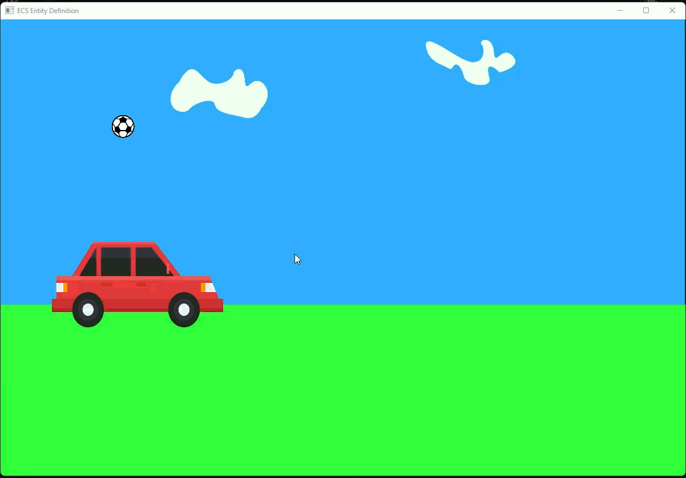

# Step 0001 — ECS Entity Definition

> *The very first building blocks: what an Entity is, what a Component is, what a System is — and how they're stored so they stay fast.*

---

## 🎯 Goals of This Stage

The goals of this stage are laid out in this step's own
[`STEP_STORY.md`](./STEP_STORY.md), which frames it as building an initial,
working understanding of five things at once:

- **Data-Oriented Design (DOD)** — organizing data by how it's accessed, not
  just by what it conceptually represents.
- **ECS architecture** — what an Entity, a Component, and a System are, and
  how that differs from defining objects the OOP way.
- **How objects are stored in ECS** — keeping each Component type in its own
  separate storage rather than bundling everything into one object.
- **The Main Loop** — the continuous loop that gathers input, updates logic,
  and renders output every iteration.
- **Delta Time** — measuring the time between loop iterations (Δt) so that
  movement (Δx = v · Δt) stays consistent regardless of frame rate.

SDL is used only as a means to make these concepts visible on screen — this
stage isn't about learning SDL itself, as `STEP_STORY.md` explicitly notes.

---

## 📌 What This Stage Contains

- **`Entity`** — a plain struct holding nothing but a numeric `Id`. No data, no behavior.
- **`Components`** — pure data structs with no logic at all: `Position`, `Size`, `Mass`,
  `Velocity`, `Color`, `Tag`, `Owner`, `Capacity`, `Specification`.
- **`System`** — an abstract base class with a single virtual `Update(...)` method.
  All game/simulation logic lives here, never inside components or entities.
- **`Storage`** — the container layer that holds everything:
  - `ComponentStorage`: one fixed-size array (`MAX_ENTITIES = 1000`) per
    component type (Structure of Arrays), each paired with a parallel
    `bool has...[]` array marking which entities actually own that component.
  - `EntityStorage`: a simple `std::vector<Entity>`.
  - `SystemStorage`: a `std::vector<std::unique_ptr<System>>`.
- **`MovementSystem`** — integrates each entity's `Position` using its `Velocity`
  and the frame's `deltaTime`.
- **`CollisionSystem`** — flips an entity's velocity when it hits the edge of the
  1200×800 window, so entities bounce instead of flying off-screen.

`main.cpp` creates two entities — a **car** and a **ball** — assigns them
components (position, size, velocity, color, owner info, and a `Tag` used to
pick the right texture), then runs the **Main Loop**: each iteration polls
input, computes **Delta Time** from the time elapsed since the previous
iteration (`std::chrono::steady_clock`), updates all systems with it, and
renders the frame using the shared [`SimpleSDL`](../Common/SimpleSDL.hpp)
rendering library.

---

## 🧠 Design Notes

(See [`STEP_STORY.md`](./STEP_STORY.md) for the full reasoning behind DOD,
ECS, and Delta Time referenced above — the notes below cover this codebase's
specific implementation choices.)

- **Structure of Arrays.** Each component type is a fixed-size C array indexed
  directly by entity ID, instead of a map-based structure. This gives O(1)
  direct access and keeps each component type contiguous in memory, which is
  friendlier to the CPU cache.
- **Polymorphic systems.** `System` is an abstract base class, and systems are
  stored as `std::unique_ptr<System>` in a vector, dispatched through a virtual
  `Update()` call.
- **Rendering stays outside the ECS.** `SimpleSDL` doesn't know anything about
  entities or components — `main.cpp` is the only place that reads component
  data and turns it into draw calls. The `Tag` component (`"car"` / `"ball"`)
  is what `main.cpp` uses to decide which texture to draw for each entity.

---

## 📂 Project Structure

```
step-0001-ecs-entity-definition/
├── CMakeLists.txt
├── assets/
│   ├── ball.svg
│   ├── car.svg
│   └── background.svg
├── include/
│   ├── Entity.hpp
│   ├── Components.hpp
│   ├── System.hpp
│   ├── Storage.hpp
│   ├── MovementSystem.hpp
│   └── CollisionSystem.hpp
└── src/
    ├── main.cpp
    ├── MovementSystem.cpp
    └── CollisionSystem.cpp
```

---

## ⚙️ Prerequisites

This stage renders a window using SDL3 + SDL3_image through the shared
`SimpleSDL` library in [`../Common`](../Common). Before building it, complete
the **one-time, repository-wide** setup described in:

➡️ [`../SETUP_SDL.md`](../SETUP_SDL.md)

(You only need to do this once — it's shared by every stage in this repository.)

---

## 🚀 Build & Run

```
cd step-0001-ecs-entity-definition
cmake -S . -B build
cmake --build build --config Release
build\Release\ecs_entity_definition.exe
```

If you get a "library not found" error while configuring, see the
troubleshooting section at the bottom of [`../SETUP_SDL.md`](../SETUP_SDL.md).

---

## 👀 What You Should See
 
A window opens showing a red car and a bouncing ball on a background image.
The ball moves diagonally and bounces off all four edges of the window; the
car moves horizontally and bounces off the left/right edges. Both are driven
purely by `MovementSystem` + `CollisionSystem` acting on their `Position` and
`Velocity` components — no special-casing per entity.
 
